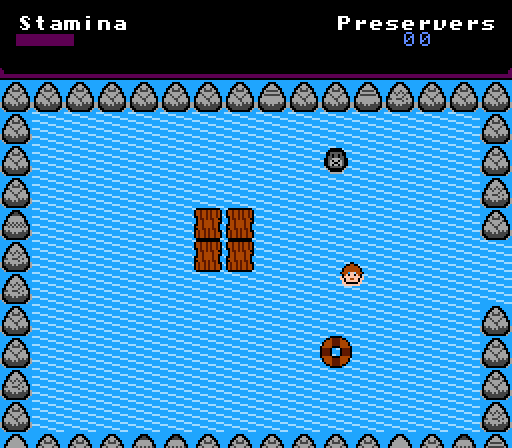
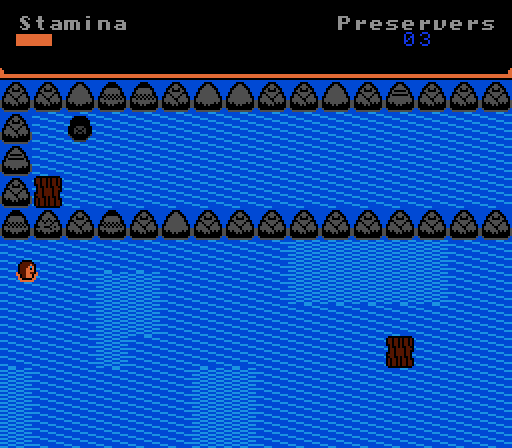

# Depths

Depths is a game about survival. 

You awake in the middle of the ocean, clinging to a piece of driftwood. You have no memory
of how you got here, however you know you need to survive. Unsure of your surroundings,
you set off to explore. 

You find yourself feeling weak, and can barely tread water. Yet somehow, you survive.

As you travel on, the seas become more treacherous. Can you make it through to the end?

**Important**: This game makes some references to suicide. If this is a concern, you may wish
to pass this game up.

[Play](http://cpprograms.net/classic-gaming/depths)

## Controls

A Button (Z): Talk/Interact

Directional Pad (Arrow Keys): Move

Start (Enter): Pause

## About the Game

I took a break from my usual carefree game style for this Ludum Dare. I wanted to make something that
has an impact on the player for once. I really am not sure how I feel about how this game came out, but I feel
I had to make it. It probably isn't for everyone, but I guess it was for me.

This game was developed for the original Nintendo Entertainment System. A ROM download is available below

It was built using [NES Starter Kit](https://nes-starter-kit.nes.science) - a C-based game library
for the NES. 

# A Note on git history

I cloned nes-starter-kit to start this off, rather than copying it this time. (For some reason...)

The first real commit for the project is here: https://gh.nes.science/depths/commit/26d51c2c2881f616e01cc20af0b90f4213728e76

(There is one commit prior that set up continuous integration and renamed the rom, but there's no project changes in that)

## Does it really work on the NES?

As usual, yep!

